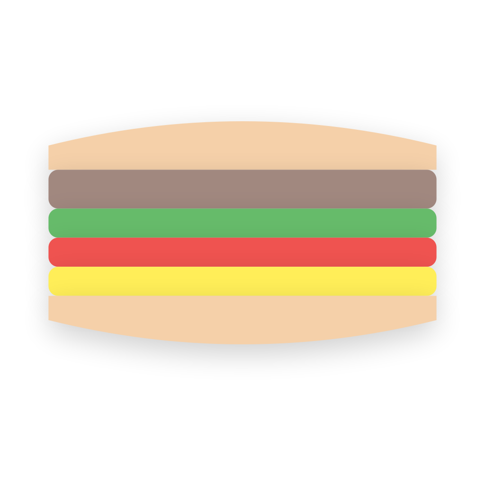
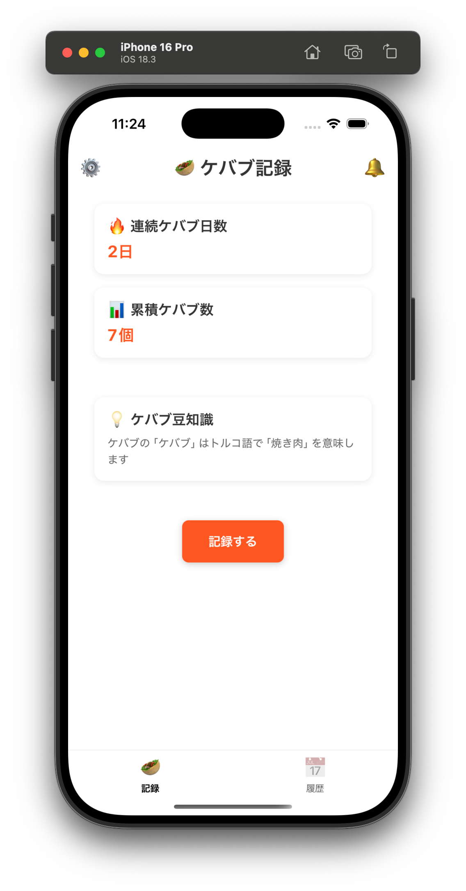

# kabab-app

<div align="center">
  
  <h3>ケバブ愛好家のための記録アプリケーション 🥙</h3>
</div>

## デモ動画

アプリケーションの動作デモをご覧ください：

https://github.com/user-attachments/assets/5dd8fdaa-2cdb-4f95-84d2-d965fcd8450d

## Requirements

- Node.js v22.14.0
- npm v11.1.0
- Volta（Node.jsとnpmのバージョン管理）
- iOS開発の場合
  - macOS
  - Xcode
  - iOS Simulator
- Android開発の場合
  - Android Studio
  - Android SDK
  - Android Emulator

## 開発環境のセットアップ

1. 必要な依存関係をインストール

```bash
npm install
```

2. iOSシミュレータで実行

```bash
npm run ios
```

3. Androidエミュレータで実行

```bash
npm run android
```

4. Web版で実行

```bash
npm run web
```

## アプリケーション利用者のペルソナ

- 毎日ケバブを食べる日本人成人男性。独身 30 代一人暮らし
- ソフトウェアエンジニア、都内在住
- 利用しているスマートフォンは iPhone
- ケバブのことを考えると夜も眠れない

## アプリケーショの要件

- ケバブ購入（食べた）の履歴を毎日つけることができるアプリ
- 最初のフェーズでは利用者は 1 人を想定しているため、ローカルに保存されていれば良い。のちにサーバサイドへの保存も検討するためそこら辺の設計は柔軟にしておきたい
- 画面構成は後述する（画面構成）
- アプリを開いてすぐに、ケバブ記録をつけることができるようにしたい
- 通知機能
  - ケバブ記録のリマインダー機能
    - 毎日指定した時刻に記録を促す通知
    - 設定画面から通知時刻の変更が可能
    - 通知をタップすると記録画面に遷移
  - プッシュ通知
    - ローカルプッシュ通知を使用
    - バックグラウンド時でも通知を表示
    - 通知音とバッジ数の表示
  - 通知履歴
    - 通知画面で過去の通知を確認可能
    - リマインダー通知も履歴に表示

## 画面構成

アプリケーションの動作デモと画面イメージは以下を参照してください：

<video width="100%" controls>
  <source src="docs/kabab-app-demo-2025-02.mp4" type="video/mp4">
  お使いのブラウザは動画の再生に対応していません。
</video>



### トップ画面（HomeScreen）
- メイン機能
  - ヘッダー部分に設定アイコン（⚙️）と通知アイコン（🔔）を配置
  - ヘッダーはノッチにかからない程度に上部に配置
- ダッシュボード機能（DashboardStats）
  - 連続ケバブ日数の表示（🔥）：毎日記録をつけることでカウントアップ
  - 累積ケバブ数の表示（📊）：これまでに食べたケバブの総数
  - ケバブ豆知識の表示（💡）：ランダムに表示される豆知識
- ケバブ記録機能（RecordForm）
  - ボトムシートでメニューを選択
  - 1日に複数回の記録が可能
  - メニューはプリセットから選択可能（kebabOptions）

### 履歴画面（HistoryScreen）
- 月別グループ表示（MonthlyGroup）
- リストビューでケバブ記録を表示（KebabHistoryItem）
- 各記録には日付、メニュー名、メモを表示

### 設定画面（SettingsScreen）
- 履歴のリセット機能
- 通知設定（ReminderTimeSheet）
  - リマインダー時刻の設定
  - 通知のON/OFF切り替え

### 通知画面（NotificationScreen）
- 通知履歴の一覧表示（NotificationItem）
- 通知の種類
  - ケバブ記録の追加通知
  - リマインダー通知
  - ケバブ豆知識の通知

## 画面デザインのテイスト

- ボトムシートにメニューを配置する
- 絵文字をふんだんに使って、親しみやすいデザインにする
- 背景色のベースは白系で、これも親しみやすいイメージにする
- イメージとしては、Notion や Zen.dev みたいな感じにする
  - https://www.notion.com/ja
  - https://zenn.dev/
- not:インドカレー屋さんのようなごちゃごちゃした感じ
- OS 標準の UI がある場合はなるべくそれを使うようする
- docs/wireframe.png に 画面イメージ画像が配置されています

## 利用技術スタック

- React Native (Expo)
- TypeScript
- React Navigation
- AsyncStorage (ローカルストレージ)
- Prettier
- React Native Elements (@rneui/base, @rneui/themed) - UI コンポーネントライブラリ
- React Native Bottom Sheet (@gorhom/bottom-sheet) - ボトムシート実装
- Volta - Node.js (v22.14.0) および npm (v11.1.0) のバージョン管理
- Zod - フォーム入力のバリデーション
- expo-notifications - ローカルプッシュ通知の実装


## 設計での制約事項
- コンポーネントに対してロジックはなるべく少なくすること
- ロジックは再利用しやすいように hooks に分離しておくこと
- 具体的なフォーム入力などはボトムシートに対して表示すること。メインビュー上にフォームを配置することは極力避ける
- ユーザからの入力を受け付ける箇所に関しては、必ずバリデーションを実装すること。バリデーションには zod を利用する
- 実装時に注意事項が生じた場合、新たに資料する技術スタックが追加された場合にはこの README または、 docs/ ディレクトリいかにドキュメントを追加すること

## アプリケーション仕様

アプリケーションの詳細な仕様、制約事項、開発ガイドラインについては `.clinerules` ファイルを参照してください。

## その他制約事項

- コミットメッセージは Conventional Commits に従うこと
  - https://www.conventionalcommits.org/ja/v1.0.0/
  - この時、スコープも必ず明示すること
  - コミットメッセージは英語で記載すること
- ライブラリ追加を伴う修正をする際には必ずラリブラリの開発元ページを確認してメンテナンス状況をチェックすること

## 作業記録

全ての作業記録は `docs/TASKLOG.md` に時系列順で保存されています。新しい作業を行う際は、以下の内容を含めて同ファイルに追記してください：

- 実装した機能の詳細
- 設計上の工夫
- コミット内容
- 新規作成したファイルとその役割
- 今後の課題
- 発生した問題と解決方法（該当する場合）

作業記録は日本語で記載し、後から見返した時にも理解できるように詳細に記述してください。
作業記録の更新自体もコミットの対象とし、適切なコミットメッセージを付与してください。

## 開発ステータス

### 完了済み
- [x] プロジェクトの初期セットアップ
- [x] 基本的なナビゲーション構造
- [x] 画面レイアウトの実装
  - [x] ホーム画面（HomeScreen）
  - [x] 履歴画面（HistoryScreen）
  - [x] 設定画面（SettingsScreen）
  - [x] 通知画面（NotificationScreen）
- [x] コアコンポーネントの実装
  - [x] ダッシュボード（DashboardStats）
  - [x] ケバブ記録フォーム（RecordForm）
  - [x] 履歴リスト（KebabHistoryItem, MonthlyGroup）
  - [x] 通知リスト（NotificationItem）
  - [x] リマインダー設定（ReminderTimeSheet）
- [x] データ管理機能
  - [x] ローカルストレージ（AsyncStorage）
  - [x] フォームバリデーション（Zod）
- [x] 通知機能
  - [x] リマインダー通知
  - [x] 記録追加通知
  - [x] 通知履歴管理

### 今後の予定
- [ ] パフォーマンス最適化
- [ ] オフライン対応の強化
- [ ] データバックアップ機能
- [ ] 統計・分析機能
